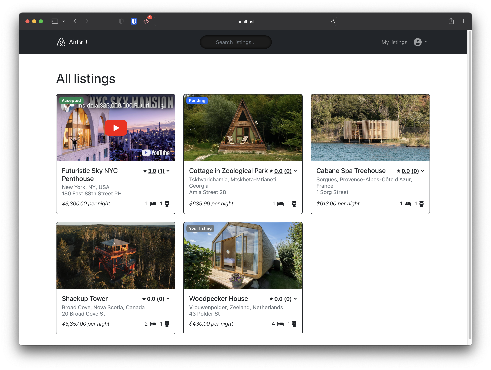
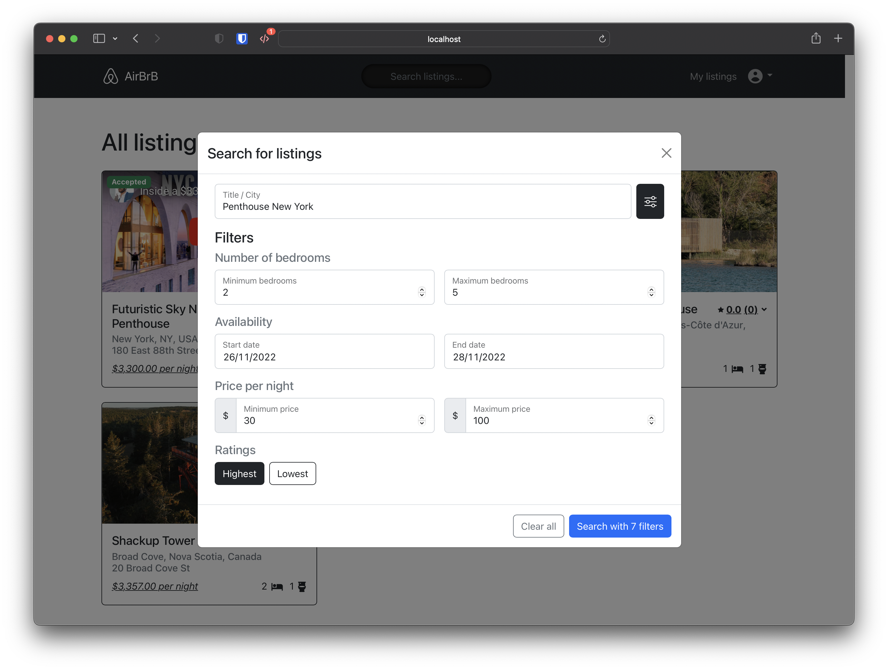
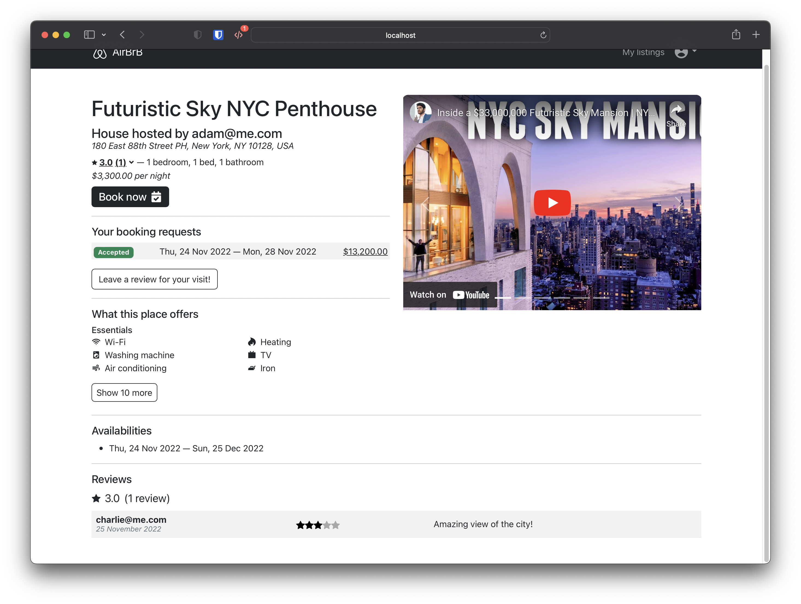
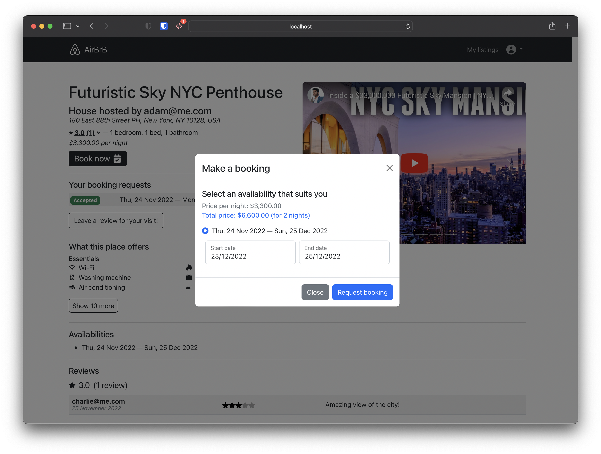
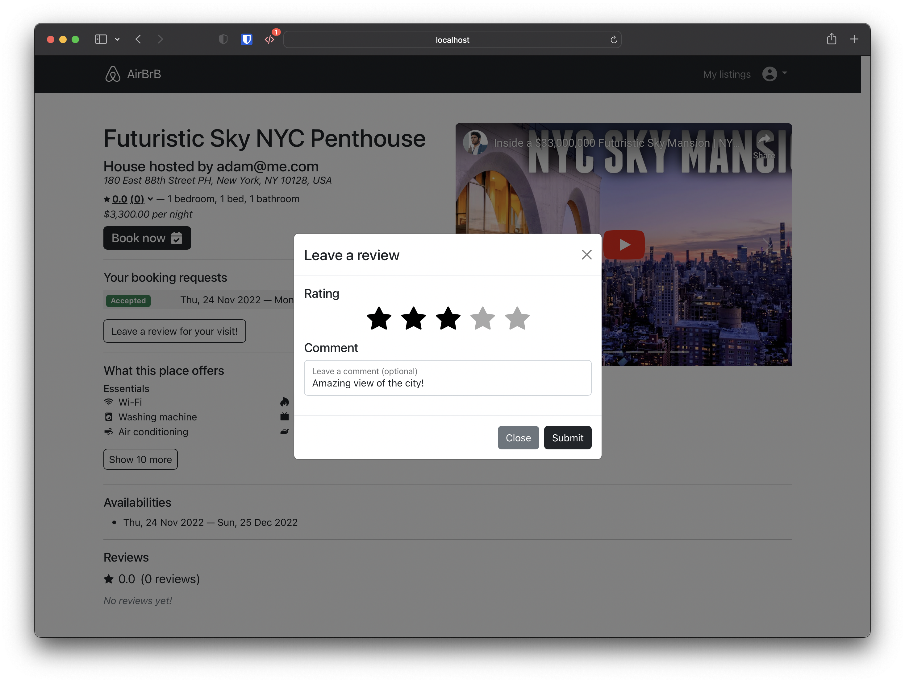
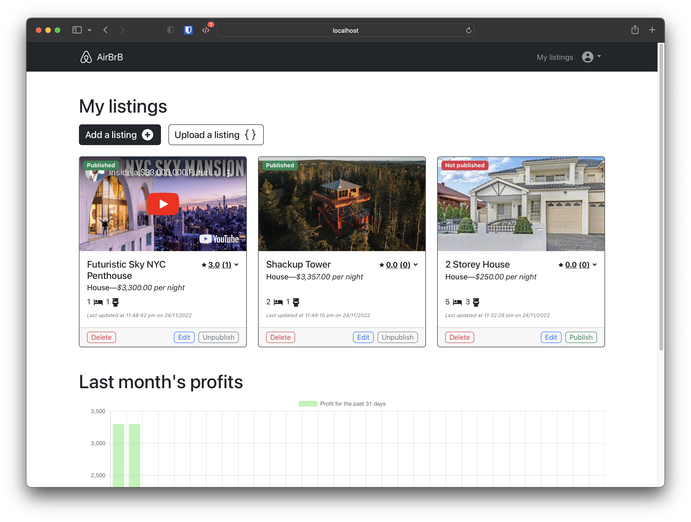
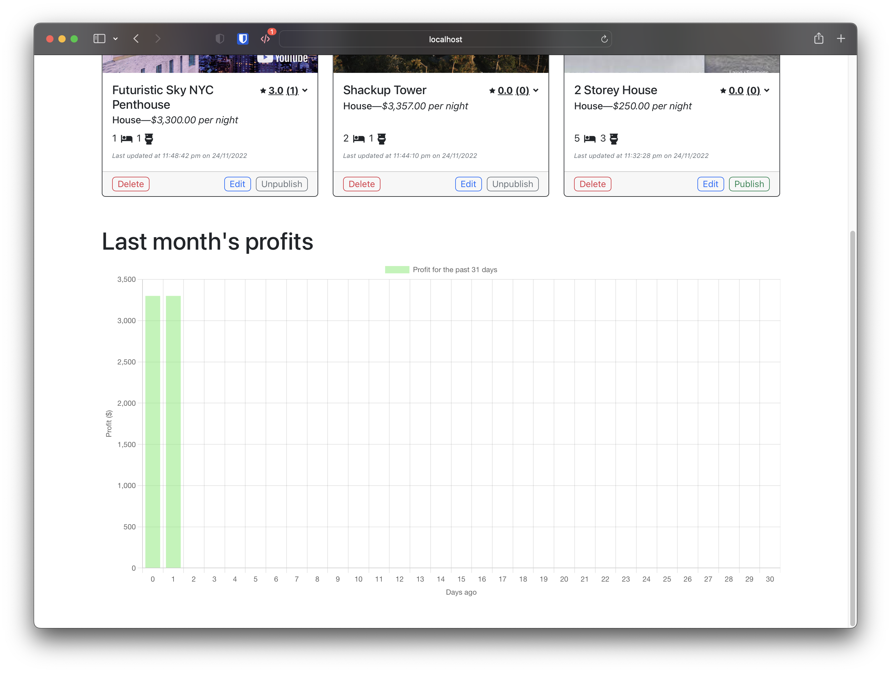
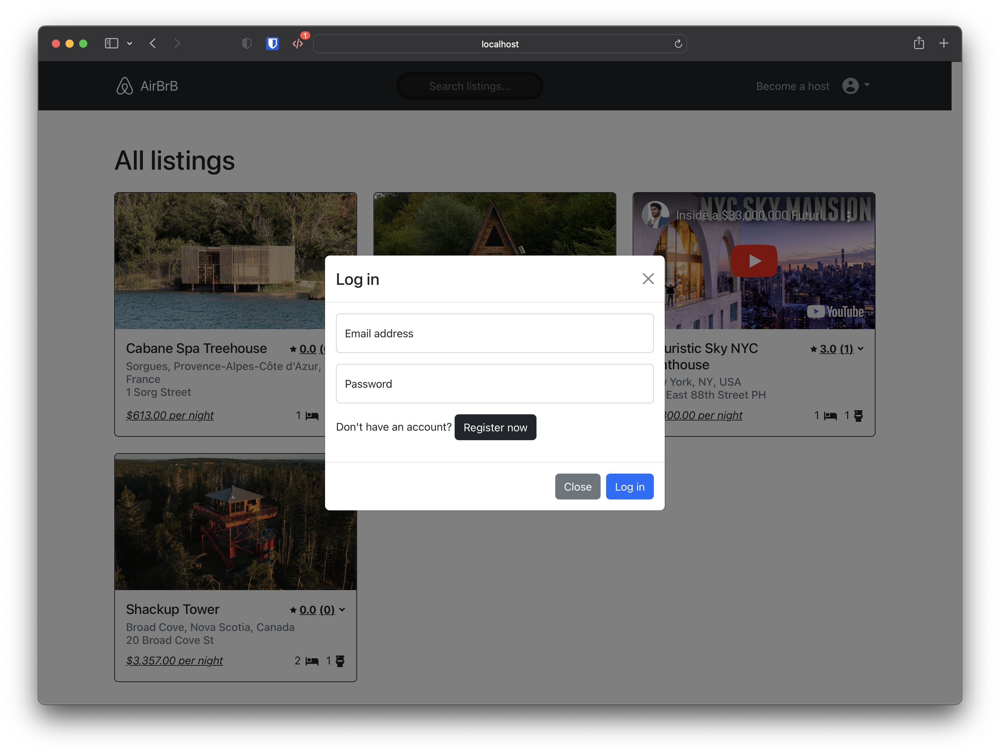
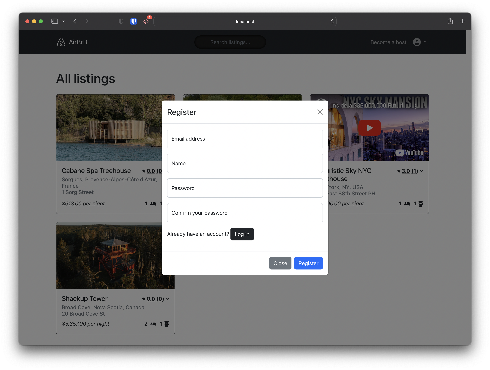

  <ul>
    
<h1 id="airbrb" style="display: inline-block;">AirBrB</h1>

  </ul>

## Table of Contents
- [Description](#description)
- [Tech Stack](#tech-stack)
  - [Packages](#packages)
  - [Testing](#testing)
- [Getting Started](#getting-started)
  - [Troubleshooting](#troubleshooting)
- [Screenshots](#screenshots)

## Description
[[Back to top]](#airbrb)
- A platform attempting to replicate popular property renting platfrom [Airbnb](https://www.airbnb.com.au/).
- Detailed features and specifications can be found on [here](./SPECS.md).
- This project's aim is to build a front-end application with the provided back-end; in order to learn the usage of front-end technlogies, communicating with the back-end, [eslint rules](./frontend/.eslintrc.json), and testing out the components and UI.

## Tech Stack
[[Back to top]](#airbrb)
- JavaScript
- ReactJS
- Node.js
- Bootstrap

### Packages
- axios
- react-router-dom
- toastify
- styled-components
- react-players
- chart.js

### Testing
- UI testing: cypress
- Component testing: cypress

# Getting Started
[[Back to top]](#airbrb)
1. browse to `/backend` and run `yarn install`
2. browse to `/frontend` and run `yarn install`
3. in `/backend`, run `yarn start`
4. in `/frontend`, run `yarn srart`

## Troubleshooting
[[Back to top]](#airbrb)
- To reset the database run `yarn reset` in `/backend`

# Screenshots
[[Back to top]](#airbrb)\
           

[[Back to top]](#airbrb)
