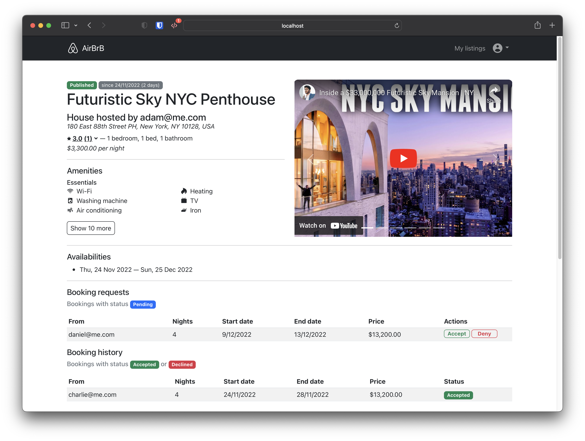
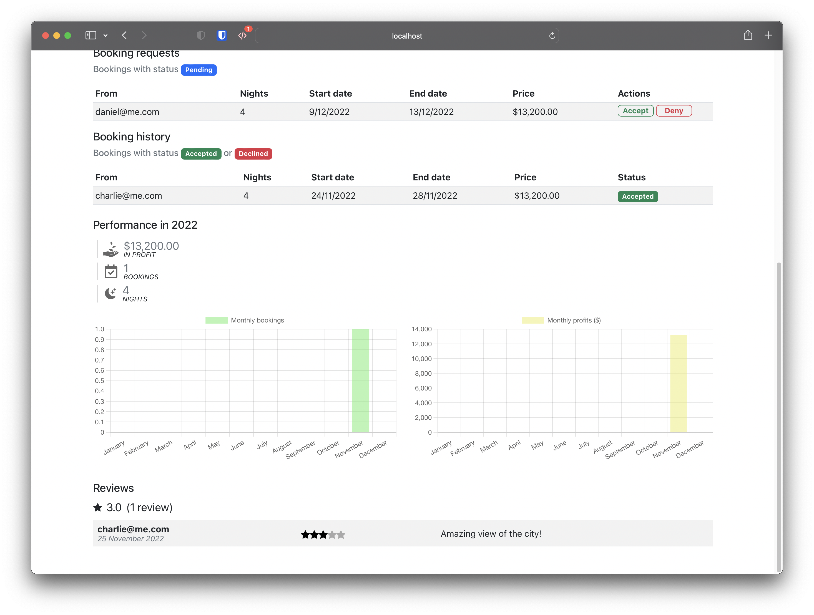

# AirBrB
## Description
- A platform attempting to replicate popular property renting platfrom [Airbnb](https://www.airbnb.com.au/).
- Detailed features and specifications can be found on [here](./SPECS.md).
- This project's aim is to build a front-end application with the provided back-end; in order to learn the usage of front-end technlogies, communicating with the back-end, eslint rules, and testing out the components and UI.
## Tech Stack
- JavaScript
- ReactJS
- Node.js
- Bootstrap
### Packages
- axios
- react-router-dom
- toastify
- styled-components
- react-players
- chart.js
### Testing
- UI testing: cypress
- Component testing: cypress

# Getting Started
1. browse to `/backend` and run `yarn install`
2. browse to `/frontend` and run `yarn install`
3. in `/backend`, run `yarn start`
4. in `/frontend`, run `yarn srart`

## Troubleshooting
- To reset the database run `yarn reset` in `/backend`

# Screenshots

